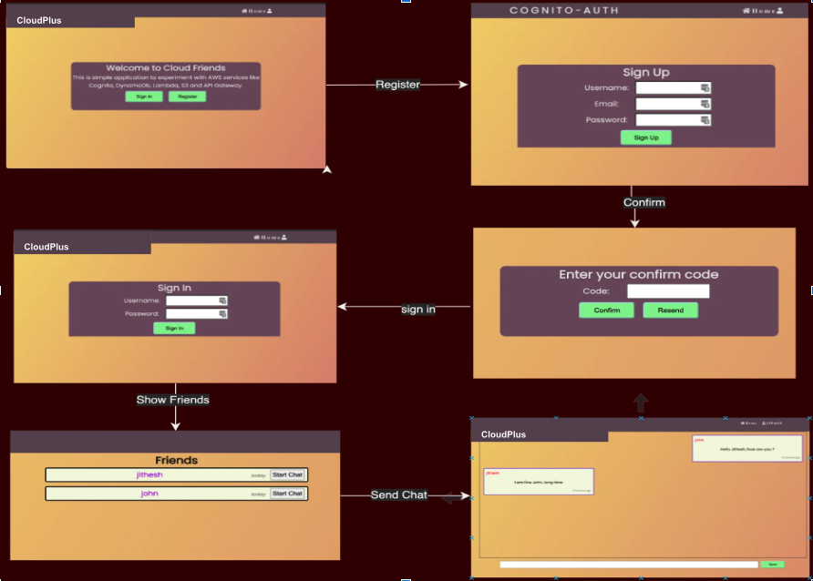
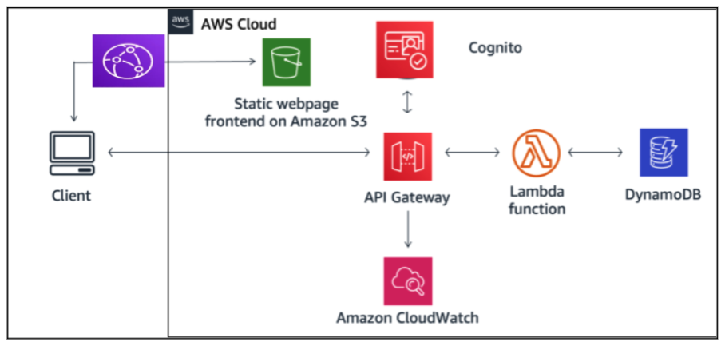
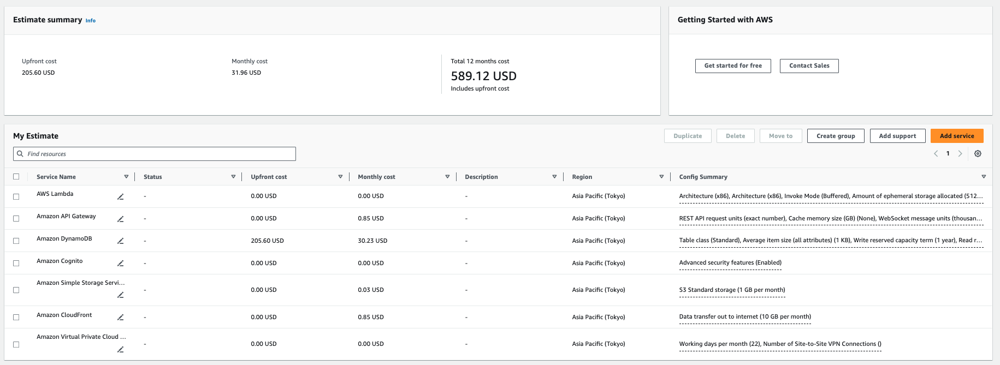

# CloudPlus Network- Deploying Scalable Web Applications on AWS: A Practical Approach

In the realm of cloud computing, AWS stands as a pivotal platform for deploying scalable web applications. 'CloudPlus Network' is a project that leverages AWS to facilitate robust online interactions and enrich connections within the digital community.

## Table of Contents
- [Background](#background)
- [Problem Statement](#problem-statement)
- [Objective](#objective)
- [Project Description](#project-description)
- [Architecture](#architecture)
- [Well-Architecture Framework](#well-architecture-framework)
- [Development Phases](#development-phases)
- [Progress Status](#progress-status)
- [Cost Estimation of AWS Services](#cost-estimation-of-aws-services)
- [Expected Outcomes](#expected-outcomes)
- [Conclusion](#conclusion)
- [Acknowledgements](#acknowledge)

## Background

Despite the widespread adoption of AWS, there's a gap in practical, hands-on experience among aspiring cloud professionals.

## Problem Statement

A noticeable divide exists between theoretical knowledge of cloud services and the practical ability to implement scalable, secure web applications on AWS.

## Objective

To architect and launch 'CloudPlus Network,' a web-based application utilizing AWS services for authentication, data management, and content delivery. The project aims to provide a practical learning experience in deploying scalable applications using AWS technologies including Cognito, Lambda, DynamoDB, S3, and CloudFront.

## Project Description

'CloudPlus Network' aims to create an accessible platform where users can seamlessly engage, sharing online spaces for interaction, showcasing the utilization of AWS for:

- Authentication (Cognito)
- Dynamic content delivery (CloudFront)
- Serverless computing (Lambda)
- API management (API Gateway)
- Data storage (DynamoDB and S3)

## Architecture

The project architecture involves a front-end built with modern web technologies, interfacing with backend services hosted on AWS. Key AWS Services include:

- Lambda for application logic
- DynamoDB for managing user data
- Cognito for secure user authentication
- S3 for static web page storage
- CloudFront
- API Gateway

## Well-Architecture Framework

The architecture described efficiently adheres to the AWS Well-Architected Framework, encompassing its six core pillars: Operational Excellence, Security, Reliability, Performance Efficiency, Cost Optimization, and Sustainability. Below is a breakdown of how this configuration supports each pillar:

| Serial No. | Pillar               | Key Components and Contributions                                                                                                                                                           |
|------------|----------------------|---------------------------------------------------------------------------------------------------------------------------------------------------------------------------------------------|
| 1          | Operational Excellence | - **CloudWatch**: Provides operational insights and automated responses to system events. - **Serverless Architecture**: Simplifies operations by reducing the need for manual server management. |
| 2          | Security              | - **Cognito**: Manages secure user authentication and access control. - **IAM Policies**: Ensures minimal and necessary permissions for service interaction. - **API Gateway**: Manages secure API access.               |
| 3          | Reliability           | - **Lambda and DynamoDB**: Managed services with built-in failover and recovery. - **DynamoDB Multi-AZ**: Enhances database availability and fault tolerance.                             |
| 4          | Performance Efficiency | - **Lambda**: Scales automatically with request volume. - **CloudFront**: Reduces latency by serving content from the nearest location. - **DynamoDB**: Provides fast, scalable performance.          |
| 5          | Cost Optimization     | - **Serverless Services**: We pay only for what we use, reducing unnecessary costs. - **S3 and CloudFront**: Economical storage and data transfer solutions.                                |
| 6          | Sustainability         | - **Serverless Architecture**: Optimizes resource usage, reducing the environmental impact. - **CloudFront**: Minimizes energy consumption by reducing data travel distances.                     |

This table provides a concise overview of how each component within the architecture supports the corresponding pillar of the AWS Well-Architected Framework, ensuring a robust, scalable environment.

## Development Phases

Outlined are the initial setup, development of Lambda functions, integration of front-end and backend, deployment, and evaluation phases.

## Progress Status

Details the progress of tasks such as Application Front-end, Initial Cloud Setup, Development, Integration, Deployment, and Evaluation with respective durations, hours required, assigned resources, start and end dates, and completion percentages.
| Task                         | Duration (Days) | Hours Required | Assigned Resources | Start Date  | End Date    | Completion |
|------------------------------|-----------------|----------------|--------------------|-------------|-------------|------------|
| Application Front-end        | 7               | 15             | 1. Shafi           | 2023-03-15  | 2023-03-22  | 100%       |
| Initial Cloud Setup          | 5               | 10             | 1. Shafi           | 2023-03-23  | 2023-03-29  | 100%       |
| Backend Development                  | 7               | 15             | 1. Shafi           | 2023-03-29  | 2023-04-04  | 100%       |
| - Lambda                     |                 |                |                    |             |             |            |
| - API Gateway                |                 |                |                    |             |             |            |
| - Cognito                    |                 |                |                    |             |             |            |
| - IAM Policies & Role        |                 |                |                    |             |             |            |
| Integration                  | 2               | 10             | 1. Shafi           | 2023-04-05  | 2023-04-08  | 100%       |
| Deployment                   | 2               | 10             | 1. Shafi           | 2023-04-09  | 2023-04-10  | 100%       |
| Evaluation                   | 2               | 10             | 1. Shafi           | 2023-04-11  | 2023-04-12  | 100%       |
| **Total**                    | **25**          | **70**         | **1**              | **2023-03-15** | **2023-04-12** | **100%** |

## Cost Estimation of AWS Services

Provides a monthly cost estimation of AWS Services, highlighting the utilization within and after the Free Tier limits.

## Expected Outcomes

Demonstrates the synergy between AWS services in web application frameworks, showcasing AWS flexibility and providing a hands-on learning experience.

## Conclusion

'CloudPlus Network' exemplifies the blend of technical know-how and practical application in deploying scalable web applications on AWS.

## Acknowledge

- Smith, A. (2020). Scaling Web Applications in Cloud Environments. Journal of Cloud Computing Advances, Challenges and Innovations, 15(3), 112-128.
- Johnson, B., & Liu, H. (2021). Comparative Analysis of AWS, Google Cloud, and Azure for Web Deployment. International Journal of Cloud Computing Services and Architecture, 11(2), 234-250.
- Carter, J. (2019). Leveraging AWS Lambda for Serverless Web Applications. Computing Trends, 9(4), 45-60.
- [AWS Best Practices for Operational Excellence](https://aws.amazon.com/architecture/well-architected/)

- [Practical AWS: Lambda, API Gateway, Cognito, Dynamo DB, S3 Hosting, and CloudFront](https://medium.com/@jith/a-practical-introduction-to-aws-lambda-api-gateway-cognito-dynamo-db-s3-hosting-and-60002b22947a)

[GitHub - CloudPulseNetwork](https://github.com/shaficse/CloudPlusNetwork.git)
