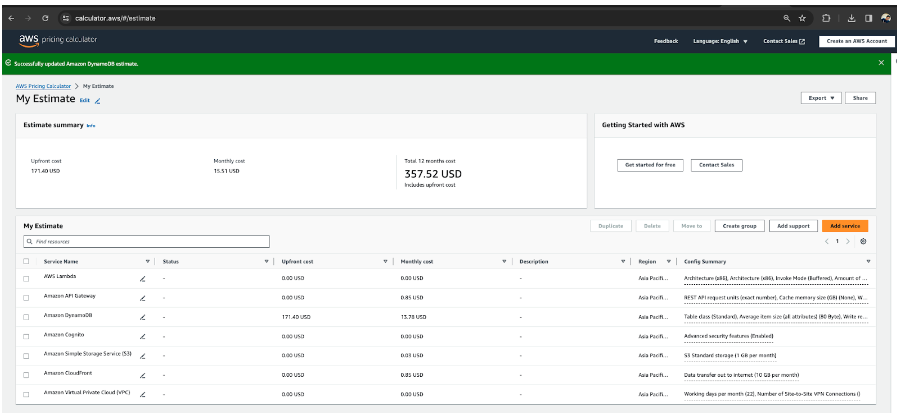

# CloudPlus Network- Deploying Scalable Web Applications on AWS: A Practical Approach

In the realm of cloud computing, AWS stands as a pivotal platform for deploying scalable web applications. 'CloudPlus Network' is a project that leverages AWS to facilitate robust online interactions and enrich connections within the digital community.

### Background

Despite the widespread adoption of AWS, there's a gap in practical, hands-on experience among aspiring cloud professionals.

### Problem Statement

A noticeable divide exists between theoretical knowledge of cloud services and the practical ability to implement scalable, secure web applications on AWS.

### Objective

To architect and launch 'CloudPlus Network,' a web-based application utilizing AWS services for authentication, data management, and content delivery. The project aims to provide a practical learning experience in deploying scalable applications using AWS technologies including Cognito, Lambda, DynamoDB, S3, and CloudFront.

## Project Description

'CloudPlus Network' aims to create an accessible platform where users can seamlessly engage, sharing online spaces for interaction, showcasing the utilization of AWS for 
- authentication (Cognito), 
- dynamic content delivery (CloudFront), 
- serverless computing (Lambda), 
- API management (API Gateway), and 
- data storage (DynamoDB and S3).
 

## Architecture

The project architecture involves
-  a front-end built with modern web technologies, interfacing with backend services hosted on AWS. 
- Key AWS Services include 
    - Lambda for application logic, 
    - DynamoDB for managing user data, 
    - Cognito for secure user authentication, 
    - S3 for static web page storage, 
    - CloudFront, and 
    - API Gateway.
 
## Well-Architecture Framework

The project aligns with the AWS Well-Architected Framework, covering Operational Excellence, Security, Reliability, Performance Efficiency, Cost Optimization, and Sustainability.

### Operational Excellence

Achieved through automation, monitoring, and iterative processes using AWS Lambda, CloudWatch, and CI/CD methodologies.

### Security

Secured by AWS Cognito for authentication, IAM for access management, and encryption of data in transit and at rest.

### Reliability

Ensured through DynamoDB, stateless Lambda functions, and resilient S3 and CloudFront services.

### Performance Efficiency

Leverages AWS Lambda, DynamoDB, and CloudFront for scalable and efficient performance.

### Cost Optimization

Minimizes costs by adjusting resources to match demand, supplemented by continuous usage monitoring.

### Sustainability

Focuses on efficient use of computing resources and planning future improvements with AWS CloudFormation to automate infrastructure management.

## Development Phases

Outlined are the initial setup, development of Lambda functions, integration of front-end and backend, deployment, and evaluation phases.

## Progress Status

Details the progress of tasks such as Application Front-end, Initial Cloud Setup, Development, Integration, Deployment, and Evaluation with respective durations, hours required, assigned resources, start and end dates, and completion percentages.

## Cost Estimation of AWS Services

Provides a monthly cost estimation of AWS Services, highlighting the utilization within and after the Free Tier limits.
 

## Expected Outcomes

Demonstrates the synergy between AWS services in web application frameworks, showcasing AWS flexibility and providing a hands-on learning experience.

## Conclusion

'CloudPlus Network' exemplifies the blend of technical know-how and practical application in deploying scalable web applications on AWS.

Code Link: [GitHub - CloudPulseNetwork](https://github.com/shaficse/CloudPulseNetwork.git)

## Acknowledge

- Smith, A. (2020). Scaling Web Applications in Cloud Environments. Journal of Cloud Computing Advances, Challenges and Innovations, 15(3), 112-128.
- Johnson, B., & Liu, H. (2021). Comparative Analysis of AWS, Google Cloud, and Azure for Web Deployment. International Journal of Cloud Computing Services and Architecture, 11(2), 234-250.
Carter, J. (2019). 
- Leveraging AWS Lambda for Serverless Web Applications. Computing Trends, 9(4), 45-60.
- Amazon Web Services. (n.d.). AWS Best Practices for Operational Excellence. Retrieved from https://aws.amazon.com/architecture/well-architected/
- Amazon Web Services. (n.d.). AWS Security Best Practices. Retrieved from https://aws.amazon.com/security/best-practices/
- Amazon Web Services. (n.d.). AWS Reliability Pillar Whitepaper. Retrieved from https://aws.amazon.com/whitepapers/architecture/reliability/
- Amazon Web Services. (n.d.). AWS Performance Efficiency Pillar. Retrieved from https://aws.amazon.com/architecture/well-architected/performance-efficiency/
- Amazon Web Services. (n.d.). AWS Cost Optimization Pillar. Retrieved from https://aws.amazon.com/architecture/well-architected/cost-optimization/
- Amazon Web Services. (n.d.). AWS Sustainability Pillar. Retrieved from https://aws.amazon.com/about-aws/sustainability/
- Practical AWS: Lambda, API Gateway, Cognito, Dynamo DB, S3 Hosting, and CloudFront https://medium.com/@jith/a-practical-introduction-to-aws-lambda-api-gateway-cognito-dynamo-db-s3-hosting-and-60002b22947a 

